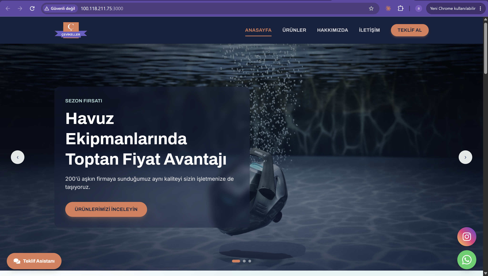
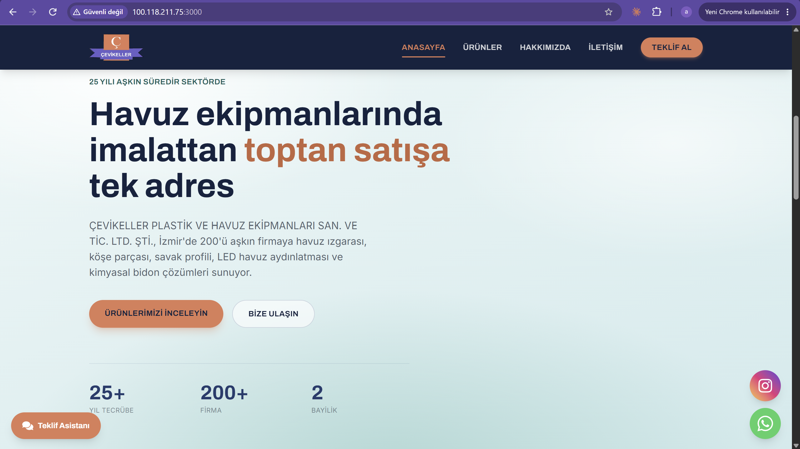
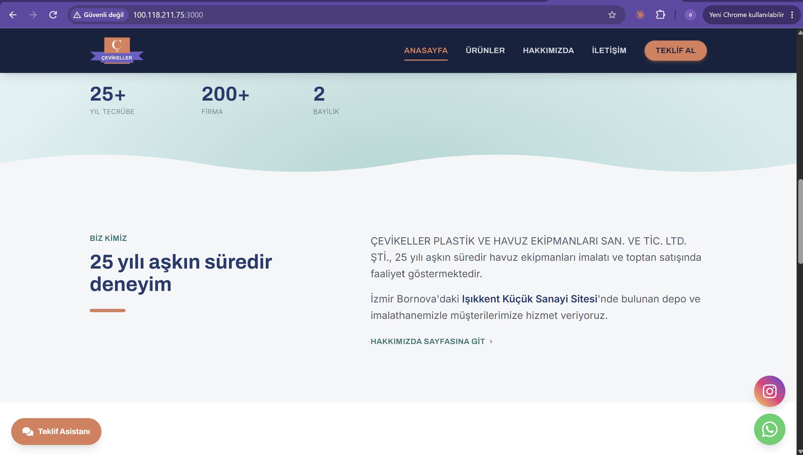
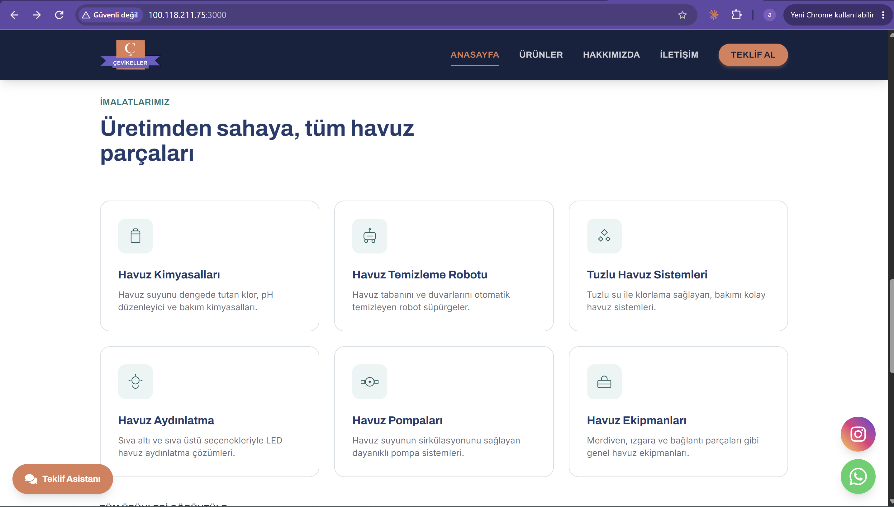
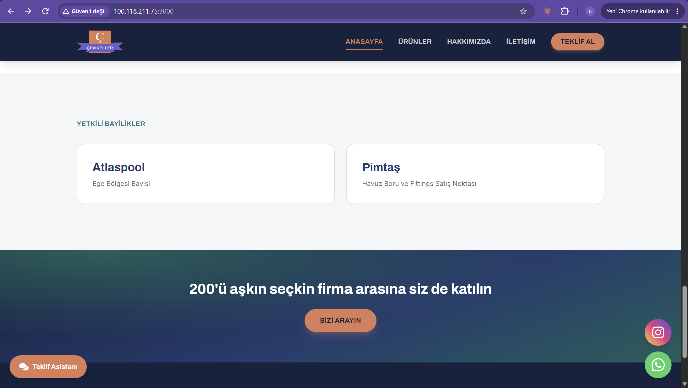
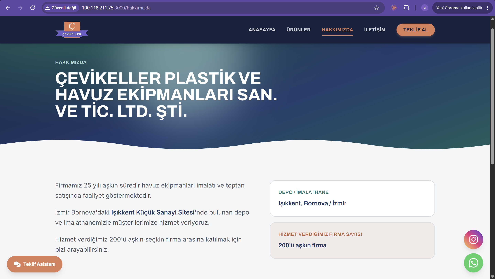
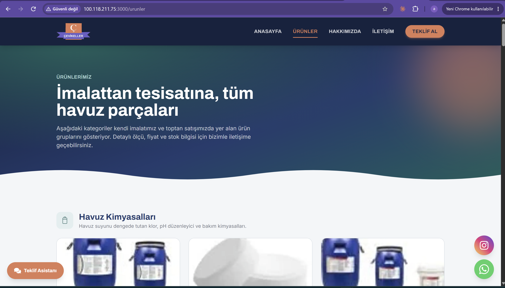
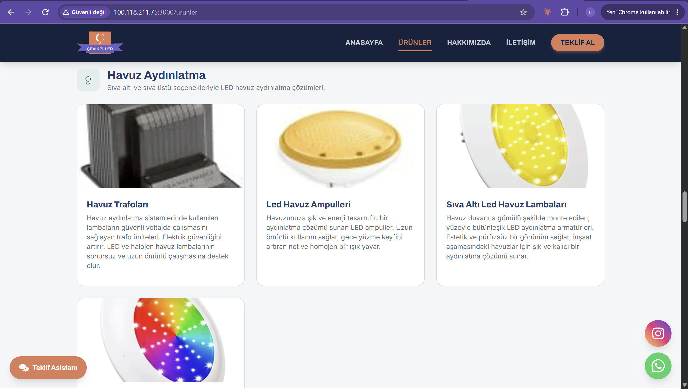
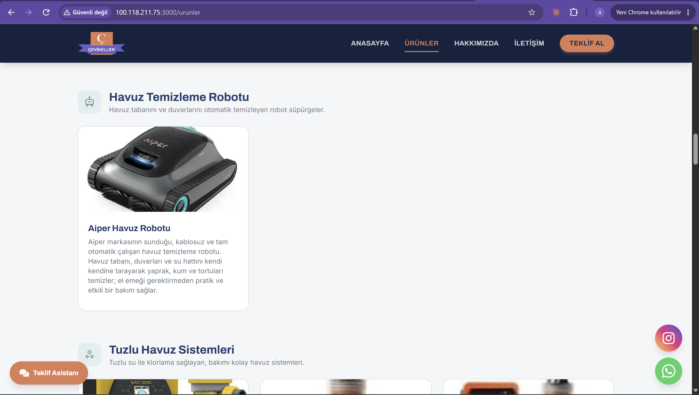

# Çevikeller Kurumsal Web Sitesi

Çevikeller Plastik ve Havuz Ekipmanları için geliştirilmiş kurumsal web sitesi.

## Ekran Görüntüleri

### Anasayfa

  

  
  

  
  

### Hakkımızda

  
  

### Ürünler

  

  
  

## Özellikler

- Sanity CMS ile yönetilebilen ürün içerikleri
- Mobil uyumlu tasarım

## Kullanılan Teknolojiler

- Next.js
- TypeScript
- Sanity CMS